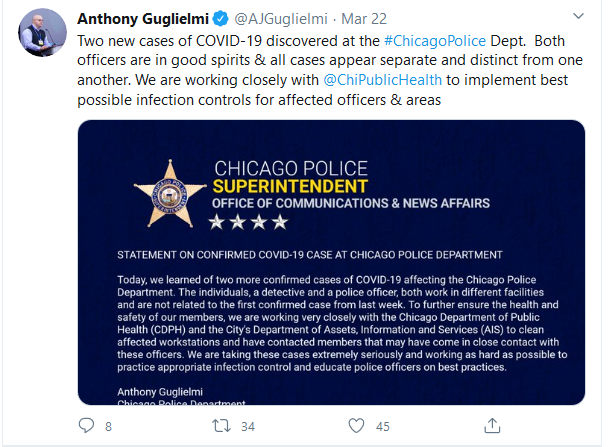

# Best Practices for Business



**Communicating about Health & Safety** 

* **Encourage employees to stay home whenever possible during this crisis.**
  * **Example:** This [tweet](https://twitter.com/sundarpichai/status/1237499299589582848?s=20) from Google CEO Sundar Pichai strikes the right tone.  

* **Communicate more, not less.** 
  * This is not the time for radio silence. 
  * Frequent communication will lessen anxiety. 
  * **Example:** [_Rensselaer Polytechnic Institute COVID-19 Latest Updates_](https://covid19.rpi.edu/communications)\_\_
* **Be transparent but positive—even when the news is bad.**
  * **Example:** [_ChicagoPolice Twitter feed_](https://twitter.com/AJGuglielmi/status/1241843627254398982?ref_src=twsrc%5Etfw%7Ctwcamp%5Etweetembed%7Ctwterm%5E1241843627254398982&ref_url=https%3A%2F%2Fwww.cnn.com%2Fworld%2Flive-news%2Fcoronavirus-outbreak-03-22-20%2Findex.html)\*\*\*\*

## Communicating about Remote Work

* **Practice remote leadership.**
  * Business leadership must be "seen" regularly in online communication channels. 
  * Show your human side, be approachable.
  * Encourage and praise workers.
  * **Example:** [_Taco Bell Twitter \#DriveThruHeroes_](https://twitter.com/tacobell/status/1241229011319169024)\_\_
  * **Example:** [_Thank God for our nurses, doctors, and all first responders._](https://twitter.com/NYGovCuomo/status/1239335925202784257?s=20)\_\_
* **Establish work/life balance.**
  * Encourage workers to go offline when the workday is done.
  * **Example:** [_Challenges to Managing Virtual Teams and How to Overcome Them_](https://www.extension.harvard.edu/professional-development/blog/challenges-managing-virtual-teams-and-how-overcome-them)\_\_
  * **Example:** __[_The Bridge Career Services_](https://twitter.com/bridge_career/status/1241498582244560896?s=20)\_\_
* **Reiterate the mission of the team to bring everyone together.**
  * **Example:** [_A Message from Kroger CEO Rodney McMullen_](https://youtu.be/LO9qqOHypXA)\_\_
  * **Example:** [_A Message from Canadian Blood Services CEO, Dr. Graham Sher_](https://twitter.com/CanadasLifeline/status/1240750756044685313?s=20)\_\_
  * **Example:** __[_A Message from CEO, FlorenceNFoundation_](https://twitter.com/FNightingaleF/status/1241664525725773824?s=20)\_\_
  * **Example**:  ****[Marriott's CEO Video](https://twitter.com/MarriottIntl/status/1240639160148529160)  

## Communicating to Customers

* **Replace in-person meetings with video conferencing.**
  * **Example:** [_HIMSS 2020 Global Health Conference & Exhibition is Going Digital_](https://www.himssconference.org/updates/himss-update-coronavirus)\_\_
  * **Example:** [_IBM Statement on Coronavirus and Events_](https://www.ibm.com/blogs/think/2020/03/ibm-statement/)
  * **Example:** [_Harvard On-Campus & Event Meeting Guidance_](https://www.harvard.edu/coronavirus/event-information)\_\_
* **Assure customers that you've made arrangements to support them.** 
  * **Example:** __[_Zoom's Commitment to User Support & Business Continuity During The Coronavirus Outbre_ak](https://blog.zoom.us/wordpress/2020/02/26/zoom-commitment-user-support-business-continuity-during-coronavirus-outbreak/)
  * **Example:** [_Trifacta blog post from Adam Wilson_](https://www.trifacta.com/blog/our-commitment-to-you/)\_\_
  * **Example:** __[_Update on 3M's Response to COVID-19_](https://www.linkedin.com/pulse/update-3ms-response-covid-19-mike-roman/)\_\_
* **Share what steps you've taken to combat the spread of the virus.**
  * **Example:** [_City of Mission Statement on Coronavirus_](https://missiontexas.us/blog/city-of-mission-statement-on-coronavirus/)\_\_
  * **Example:** _****_[_Message from IEEE on Coronavirus COVID-19_](https://www.ieee.org/about/news/2020/message-on-covid-19.html)\_\_
  * **Example:** __[_How Whole Foods Market is Responding to COVID-19_](https://media.wholefoodsmarket.com/news/how-whole-foods-market-is-responding-to-covid-19)\_\_

## Communicating about Disaster and Continuity Planning

* **Assemble a crisis management response team to define protocols and processes.** This will prevent leaders and staff from overreacting to the crisis.
  * **Example:** [_Leadership in a Crisis. Responding To The Coronavirus Outbreak and Future_](https://www.mckinsey.com/business-functions/organization/our-insights/leadership-in-a-crisis-responding-to-the-coronavirus-outbreak-and-future-challenges)
  * **Example:** [National COVID-19 Strategic Counsel For Your Organization](https://www.national.ca/en/landing/national-launches-coronavirus-crisis-communications-team/)
* **Have an internal and external communications plan in place.** 
  * **Example:** [_AON Communication Plan_](https://www.aon.com/getmedia/d014d969-0ef1-4a90-8a0b-ecadf39f0a06/Novel-Coronavirus-Communication-Plan-Sheet-Feb2020.aspx)\_\_
  * _**Example:**_ [_American Animal Hospital Association_](https://www.aaha.org/publications/newstat/articles/2020-03/coronavirus-guide-communicating-with-staff-and-clients/)\_\_
* **Coordinate with clients and key vendors.**
  * **Example:** [_Inmar Intelligence_](https://www.inmar.com/blog/thought-leadership/novel-coronavirus-client-communication)\_\_
  * **Example:** [_Zions Bank_](https://www.zionsbank.com/LandingPages/specialtypage/CoronavirusClientCommunication/)\_\_

## Communicating about Helping Your Community	

* **Provide relief to clients or employees.**
  * **Example:** [_JetBlue waives change and cancel fees._](http://blog.jetblue.com/coronavirus/) 
  * **Example**:[ _Tech Giants Will Keep Paying Hourly Staff Even If They Are Asked To Stay Home Due To Coronavirus_](https://www.theverge.com/2020/3/6/21168395/coronavirus-tech-hourly-workers-pay-amazon-google-facebook)\_\_
* **Share positive stories with employees to keep them motivated.**
  * **Example:** __[_Facebook Commits To Paying 'Contingent' Workers Affected By Corporate Coronavirus Response_](https://techcrunch.com/2020/03/06/facebook-commits-to-paying-contingent-workers-affected-by-corporate-coronavirus-response/)\_\_
  * **Example:** __[_Loom Pro Free for Students and Teachers_](https://support.loom.com/hc/en-us/articles/360006579637-Loom-Pro-Free-for-Students-and-Teachers)\_\_
* **Prepare for business recovery.** 
  * Move beyond the crisis to plan your post-recovery strategy.
  * **Example:** __[_Amazon Creates $5M Relief Fund To Aid Small Businesses in Seattle Impacted By Coronavirus_](https://techcrunch.com/2020/03/10/amazon-creates-5m-relief-fund-to-aid-small-businesses-in-seattle-impacted-by-coronavirus-outbreak/)\_\_
  * **Example:** __[_How Chinese Companies Have Responded to Coronavirus_](https://hbr.org/2020/03/how-chinese-companies-have-responded-to-coronavirus)\_\_

## Trusted Resources

* \_\_[_Coronavirus Best Practices for Small Business_](https://www.uschamber.com/co/start/strategy/small-business-coronavirus-best-practices) __ from the U.S. Chamber of Commerce
* \_\_[_Interim Guidance for Business and Employers_](https://www.cdc.gov/coronavirus/2019-ncov/community/guidance-business-response.html) __from the Centers for Disease Control and Prevention \(CDC\)
* \_\_[_5 Ways to Calm Coronavirus Fears Among Your Employees_](https://www.uschamber.com/co/run/human-resources/keeping-employees-calm-during-coronavirus-pandemic) __from the U.S. Chamber of Commerce
* \_\_[_Plan Ahead for Disasters_](https://www.ready.gov) Ready.gov

