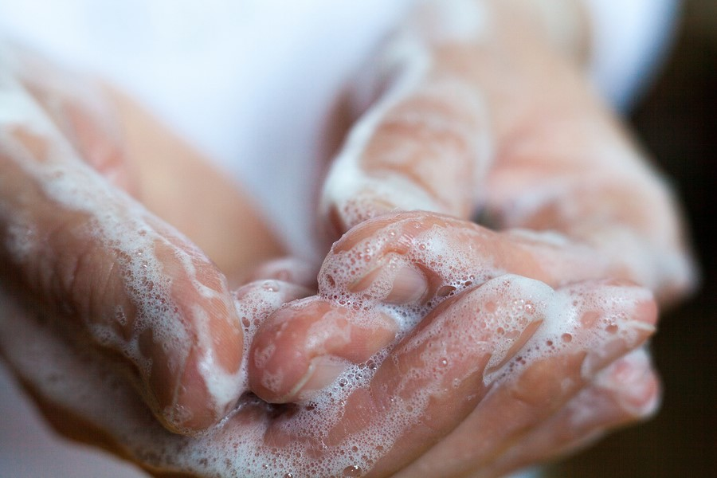
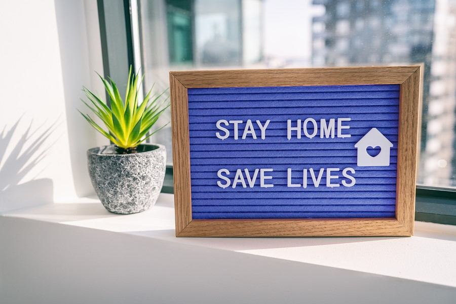

# Best Practices for Government

## Communicating about Health & Safety 

* **Accept and involve stakeholders**. Health and safety is a community effort and will require every citizen to contribute in some way. Engaging with all stakeholders increases the effort and value of the contribution.  **Example:** The Centers of Disease Control guidance page [Get Your Community- and Faith-Based Organizations Ready for Coronavirus Disease 2019](%20https://www.cdc.gov/coronavirus/2019-ncov/community/organizations/guidance-community-faith-organizations.html). Notice it is specifically designed for this community where needed while adhering to the key overall messaging.
* **Choose a broad range of spokespeople from all walks of life.** Government touches everyone’s lives, and choosing people who can speak directly to different groups assures a wider spread of the message.

  **Example:** [WHO and FIFA: Pass The Message video](https://twitter.com/WHO/status/1242123569146089472)

* **Update regularly and clearly across all channels.** Short, simple, accessible and direct messages across multiple formats raises the visibility of the message and limits confusion. **Example:** The [Centers of Disease Control Twitter feed](https://twitter.com/CDCgov), with clear visuals and informative links posted on a regular basis 

## Communicating about Remote Work

* **Remember that not everyone can work remotely.** Working from home simply isn’t possible for some, especially vital services, and they will need support as well. **Example:** The [State of Massachusetts’ COVID-19 Guidance and Directives](https://www.mass.gov/info-details/covid-19-guidance-and-directives#businesses-&-employment-), broken out by individual government departments and industries
* **Offer resources to adapt quickly.** Telework is new to much of the workforce. Clear, easy-to-read materials will assist in the transition. **Example:** The [US General Services Administration’s guidance on remote work](https://www.gsa.gov/governmentwide-initiatives/telework/resources-for-managing-teleworkers)
* **Address infrastructure concerns where possible.** Not everyone is equipped to work from home immediately, so collecting resources to get workers up to speed will be crucial. **Example:** The [City of Boston’s guide to internet access for remote workers](https://www.boston.gov/news/internet-connectivity-and-technology-supports-during-covid-19-response) across the city. 

## Communicating to Citizens

* **Use graphics, video, and other modes of communication.** This spreads the message and sets the proper tone in multiple ways. **Example:** The [County of LA Twitter feed](https://twitter.com/CountyofLA), which uses appropriate images and motion graphics to draw the eye and summarize necessary information in multiple ways. 
* **Multilingualism will be key.** Catering to the language of all stakeholders will allow for more effective communication and compliance. **Example:** The [City of New York’s COVID-19 page](https://www1.nyc.gov/site/doh/covid/covid-19-main.page), with flyers in over twenty languages: 
* **Honesty is the best policy.** Direct, clear information that acknowledges basic realities of life will be appreciated and help limit the spread. **Example:** The [Centers for Disease Control’s Environmental and Disinfection Guidelines](https://www.cdc.gov/coronavirus/2019-ncov/community/organizations/cleaning-disinfection.html), which use clear subheadings and tie into available supplies and techniques

## Communicating about Disaster and Continuity Planning

* **Be direct, but calm.** Tone of public communications will be particularly important to limit the spread of fear and the downstream problems it causes. **Example:** The [City of Cambridge’s COVID-19 Services page](%20https://www.cambridgema.gov/covid19/services), offering clear concise descriptions of what services are available and the necessary conditions. 
* **Deliver clear instructions.** Most organizations are facing unprecedented challenges and will need effective guidance that can followed easily and precisely. **Example:** The [City of Philadelphia’s detailed planning guidance for private businesses and non-profits](https://www.phila.gov/services/mental-physical-health/environmental-health-hazards/covid-19/planning-guidance-for-businesses-and-nonprofit-organizations/). 
* **Emphasize planning ahead of time.** The more citizens are prepared, the more effective guidance and restrictions will be. **Example:** The [City of Chicago’s COVID-19 page ](https://www.chicago.gov/city/en/sites/covid-19/home.html)has a “Helpful Resources” section that emphasizes planning ahead.

## Communicating about Helping Your Community	

* **Bust myths as they appear.** Misinformation can spread quickly if it’s not counteracted by authoritative statements. **Example:** [FEMA’s Rumor Control page](https://www.fema.gov/Coronavirus-Rumor-Control), which specifically refutes misinformation point by point. 
* **Encourage donations and volunteerism, where possible.** While volunteerism can be difficult under social distancing rules, donations and assistance are still possible. **Example:** The[ City of Cambridge’s disaster relief fund page](https://www.cambridgema.gov/news/2020/03/mayorsdisasterrelieffundforcovid19)
* **Highlight ways they can help.** Encourage visiting local businesses, interacting with communities, and other methods. **Example**: [Mayor Jenny Durkin, of Seattle](%20https://www.cambridgema.gov/news/2020/03/mayorsdisasterrelieffundforcovid19), patronizing local businesses for take-out and tweeting out her support.

## Trusted Resources

\*\*\*\*[**FEMA's Coronavirus Page**](https://www.fema.gov/coronavirus)\*\*\*\*

\*\*\*\*[**The CDC's Coronavirus Page**](%20https://www.cdc.gov/coronavirus/2019-ncov/index.html)\*\*\*\*

\*\*\*\*[**The World Health Organization's Coronavirus Page**](%20https://www.who.int/health-topics/coronavirus#tab=tab_1)\*\*\*\*

