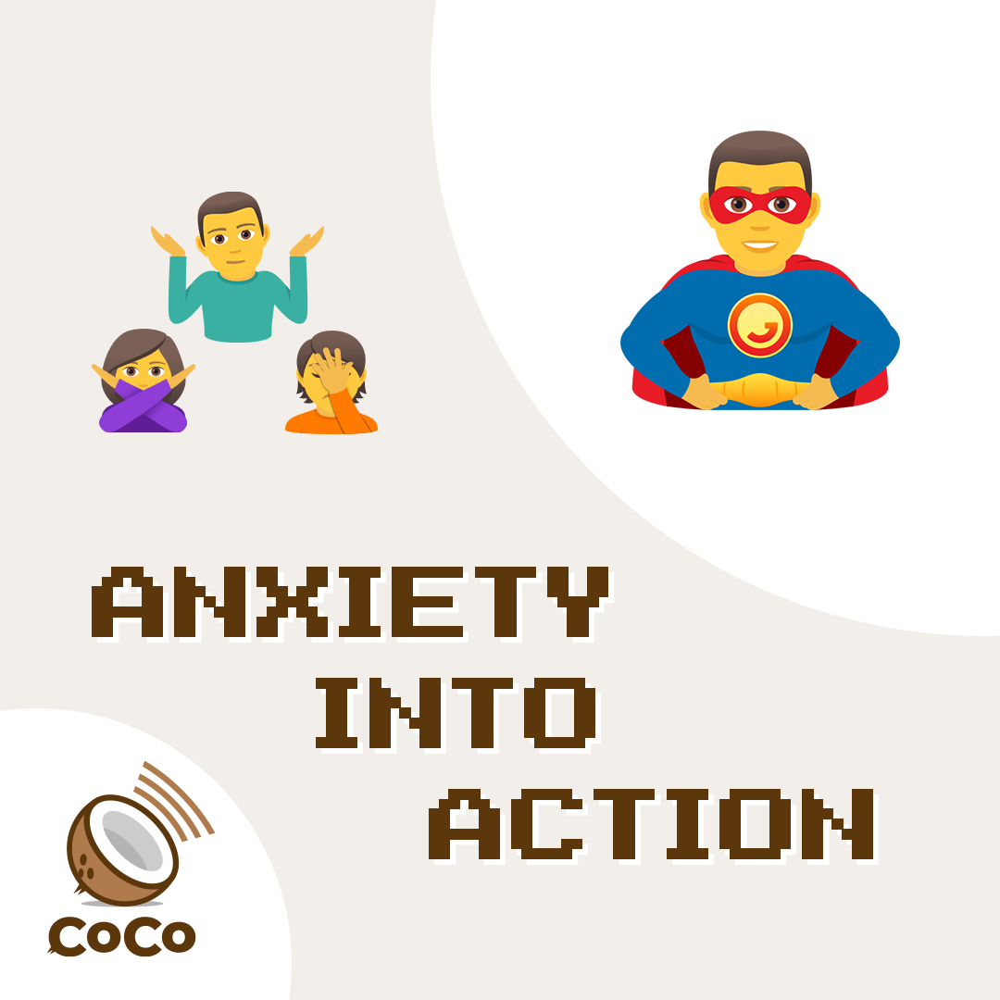

# Anxiety Into Action



## Copy, paste, and post:


Channel anxiety into action, let fear push you forward. Don't just worry, do something. \#anxaction \#coco


## Why This is Important:


Helping the public understand that we must all acknowledge feelings, then channel them into action: a global pandemic requires a global response. \[Source: [Center for Disease Control](https://www.cdc.gov/flu/pandemic-resources/pdf/pandemic-influenza-strategy-2005.pdf)\]


## Shoot a video:

_No fancy set. No hair and makeup. No need to memorize. Just turn the camera on yourself \(in landscape mode\) and read one of these lines:_

* Hi, this is \[NAME\]. Convert ANXIETY INTO ACTION: Don't just stand there, do something. Everyone can help in the \#Coronacrisis. You'll feel better. Now take this message and pass it on: spread the word, not the germ. 
* This is \[NAME\] reminding you to channel anxiety into action. Let FEAR push you FORWARD. Don't just worry, DO SOMETHING. You'll feel better. Now take this message and pass it on: spread the word, not the germ. 
* This is \[NAME\]. I'm nervous, I'm scared, just like you. But don't just worry, ACT. You'll feel better and you'll make a difference. We can all do something to help, every day. First thing you can do is take this message and pass it on: spread the word, not the germ. 
* Hey, \[NAME\] here. Anxious? Afraid? Do something nice for someone else. Do a \#CoCo. You'll feel better. Turn Anxiety into Action. Now take this message and pass it on: spread the word, not the germ. 
* This is \[NAME\] reminding you that ANXIETY and FEAR are the two great allies of \#Coronavirus. You can defeat them by doing something to help someone else. CONVERT ANXIETY INTO ACTION.  Now take this message and pass it on: spread the word, not the germ.

## Use this hashtag:


\#AnxAction


## Share these images:

## Additional Notes:

* To be deployed in all global regions ASAP.
* Need translators to communicate this message locally. \[See [How to Help](../how-to-help.md)\]

