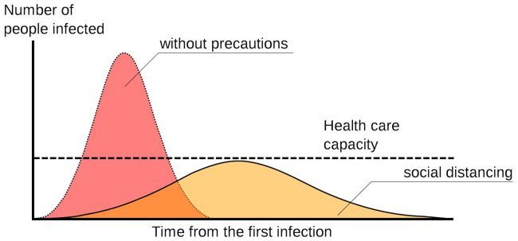
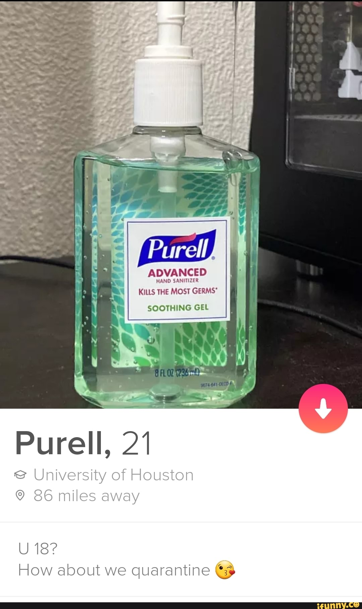

# Flatten the Curve

## Copy, paste, and post:


Viruses spread quickly, but they don't have to if you stay in and stay away \#FlattenTheCurve


## Why This is Important:


The rate at which a population becomes infected makes all the difference in whether there are enough resources to treat the sick. \[Source: [Live Science](https://www.livescience.com/coronavirus-flatten-the-curve.html)\]


## Shoot a video:

_No fancy set. No hair and makeup. No need to memorize. Just turn the camera on yourself \(in landscape mode\) and read one of these lines:_

* Hi, this is \[NAME\]. Some hospitals are already filled to capacity. Stay inside to keep yourself healthy, and keep other people healthy as well. We can all do our part to \#FlattenTheCurve. Now take this message and pass it on: spread the word, not the germ. 
* Hi, \[NAME\] here. A slower infection rate means that our Healthcare Heroes have more time to treat the sick. Do your part to \#FlattenTheCurve. Now take this message and pass it on: spread the word, not the germ. 
* Hey, \[NAME\] reminding you that when you do your part, you help our Healthcare Heroes and our healthcare systems. We're not just doing it for ourselves, we're doing it for others: to help \#FlattenTheCurve. Now take this message and pass it on: spread the word, not the germ.

## Share these images:

## Additional notes:

* To be deployed in all global regions ASAP.
* Need translators to communicate this message locally. \[See [How to Help](../how-to-help.md)\]

