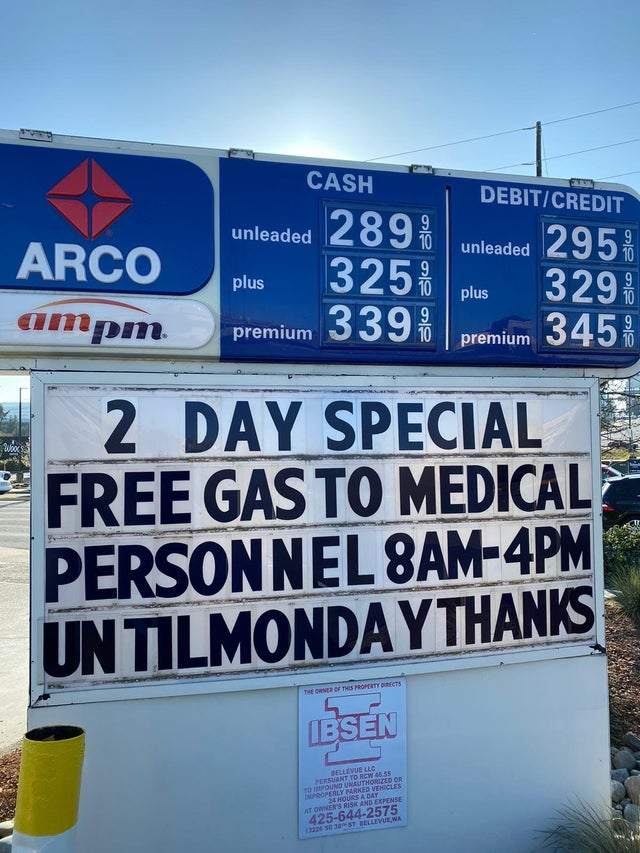

# Healthcare Heroes



## Copy, paste, and post:


SUPPORT OUR HEALTHCARE HEROES, who are on the front lines of the \#Coronacrisis. Do a \#CoCo!


## Why This is Important:


Helping the public understand the extreme burden on our healthcare system -- and our human healthcare workers -- inspiring them to find creative ways to help. \[Source: [World Health Organization](https://www.who.int/csr/resources/publications/ebola/recovery-toolkit/en/)\]


## Shoot a video:

_No fancy set. No hair and makeup. No need to memorize. Just turn the camera on yourself \(in landscape mode\) and read one of these lines:_

* Hi, this is \[NAME\] reminding you that our \#HealthcareHeroes are the first responders in the fight against \#Coronavirus. Find ways to support them, even if it's just a quick thank you. Now take this message and pass it on: spread the word, not the germ. 
* This is \[NAME\]. Our \#HealthcareHeroes are literally putting their lives on the line. Find a way to support them: equipment, food, or a phone call. Now take this message and pass it on: spread the word, not the germ. 
* This is \[NAME\] and I want to remind you that everyone can support our Healthcare Heroes in some way: bring them food, say thanks, donate blood. What can YOU do? Think about it, then pass along this message: spread the word, not the germ. 
* Hi, this is \[NAME\]. Healthcare Heroes are literally saving the world from \#Coronavirus. Doctors, nurses, admins, EMTs, insurance workers: THANK YOU! Now take this message and pass it on: spread the word, not the germ. 
* Ths is \[NAME\] reminding you to HELP OUR HEALTHCARE HEROES. Find some small way to contribute to the healthcare effort today. Find some way to do a \#CoCo in the global healthcare effort. Now take this message and pass it on: spread the word, not the germ.

## Use this hashtag:


\#HealthcareHeroes


## Share these images:





## Additional Notes:

* To be deployed in all global regions ASAP.
* Please help by translating this message into your local language. \[See [How to Help](../how-to-help.md)\]

