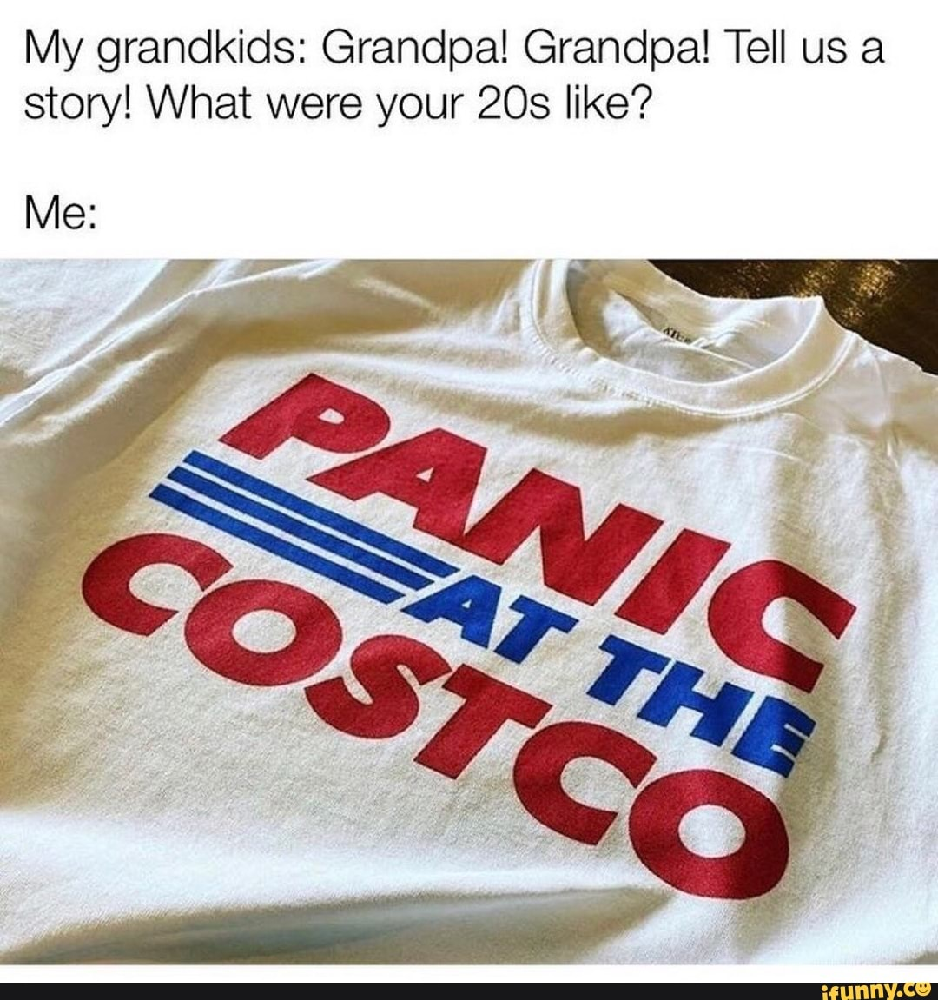

# Help, Don't Hoard



## Copy, paste, and post:


HELP, DON'T HOARD: Take care of yourself, but also leave some for others during the \#Coronacrisis. Do a \#CoCo.


## Why This is Important:


Helping the public understand that there will be more than enough to survive this pandemic, if we can resist this panic. \[Source: [Center for Disease Control](https://www.cdc.gov/flu/pandemic-resources/pdf/pandemic-influenza-strategy-2005.pdf)\]


## Shoot a video:

_No fancy set. No hair and makeup. No need to memorize. Just turn the camera on yourself \(in landscape mode\) and read one of these lines._

* Hi, this is \[NAME\]. HELP, DON'T HOARD: Take care of yourself, but also take care of others during the \#Coronacrisis. There will be enough, if we all work together. Now take this message and pass it on: spread the word, not the germ. 
* Hey, it's \[NAME\]. Here's a thought: maybe instead of buying EVERY \[item -- toilet paper, bottle of bleach, can of Spam\], you could buy just what you need, so there's some left for others? HELP, DON'T HOARD. Now take this message and pass it on: spread the word, not the germ. 
* This is \[NAME\] reminding you to buy what you need, but leave some for everyone else. You're not going to starve. Help, don't hoard. Now take this message and pass it on: spread the word, not the germ. 
* \[NAME\] here. If we resist the PANIC, we survive the PANDEMIC. Help, don't hoard. Now take this message and pass it on: spread the word, not the germ. 
* This is \[NAME\] reminding you: Don't be a Prepper. When we resist the panic, we survive the pandemic. HELP, DON'T HOARD. Now take this message and pass it on: spread the word, not the germ.

## Use this hashtag:


\#HelpDontHoard   
_\(Note: any pictures of fully-stocked store shelves can be tagged \#HelpDontHoard\)_


## Share these images:

## Additional Notes:

* To be deployed in all global regions ASAP.
* Need translators to communicate this message locally. \[See [How to Help](../how-to-help.md)\]

