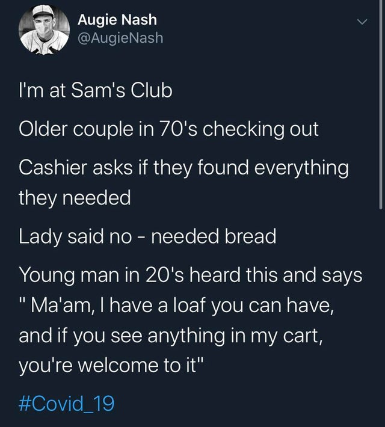
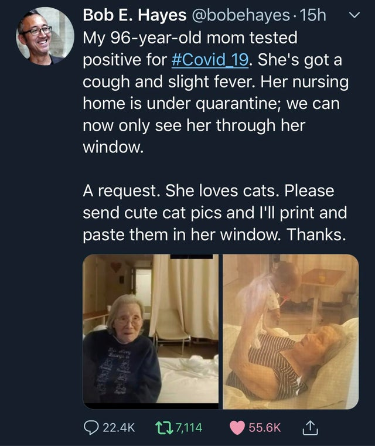

# Humans Helping Humans



## Primary Message:


When humans help humans, we get through the \#Coronavirus faster and easier.


## Why This is Important:


Helping the public understand that a global pandemic means we're all in this together: to make it through, everyone needs to lend a helping hand. \[Source: [Center for Disease Control](https://www.cdc.gov/flu/pandemic-resources/pdf/workshop.pdf)\]


## Message Points:

_5-10 message points that can be used as "springboards" for blog posts and social media._

* HUMANS HELPING HUMANS: When we all work together, we get through the \#Coronacrisis as quickly as possible.
* We're all in this together. The \#Coronacrisis means its time to set aside differences and help each other out. \#HumansHelpingHumans
* \[Talk about anything you or someone else have done to help, no matter how small.\] \#HumansHelpingHumans
* \[Encourage other people to share their recent examples of Humans Helping Humans; you'll be surprised at the response\]
* \[Encourage other people to share creative ideas on how humans can help humans.\]

## Link Here:



## Hashtag:


\#humanshelpinghumans, \#humansbeingbros _\[Note: Any image with people helping each other can use these hashtags.\]_


## Supporting Visuals:

## Additional Notes:

* To be deployed in all global regions ASAP.
* Need translators to communicate this message locally. \[See [How to Help](../how-to-help.md)\]

