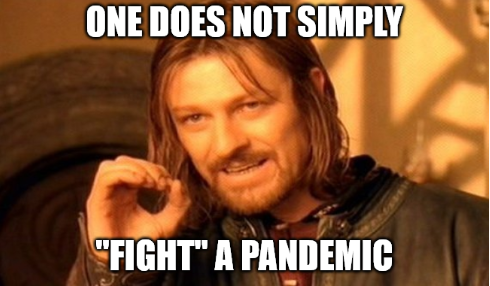
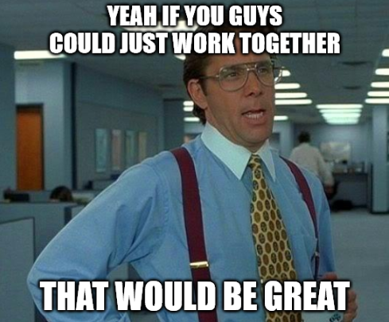
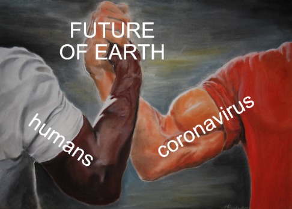

# Humans vs. Virus

## Primary Message:


There is only one enemy: \#Coronavirus. If we work together, we will win. \#humans20covid19 \#coco


## Why This is Important:


Helping the public understand that arguing and blaming each other wastes precious time and energy, which we must focus into the fight against the virus. \[Source: [Center for Disease Control](https://www.cdc.gov/flu/pandemic-resources/pdf/workshop.pdf)\]


## Message Points:

_5-10 message points that can be used as "springboards" for blog posts and social media._

* Great teams do great things. Humanity is one great team.
* STAY FOCUSED: The enemy is \#COVID19, not each other.
* \#Coronavirus wants humans to fight, so it can win. Don't give in.
* To defeat \#Coronavirus, we have to think like a virus. That means working together, as one human species.
* Stick together and save the world. If we work together, we will win. \#coco

## Link Here:



## Use this Hashtag:


\#humans20covid19


## Supporting Visuals:


Arguing and blaming each other wastes precious time and energy, which we must focus into the fight against the virus. 


## Additional Notes:

* To be deployed in all global regions ASAP.
* Please help by translating this message into your local language. \[See [How to Help](../how-to-help.md)\]
* Be wary of falling into the trap of "arguing about not arguing."

