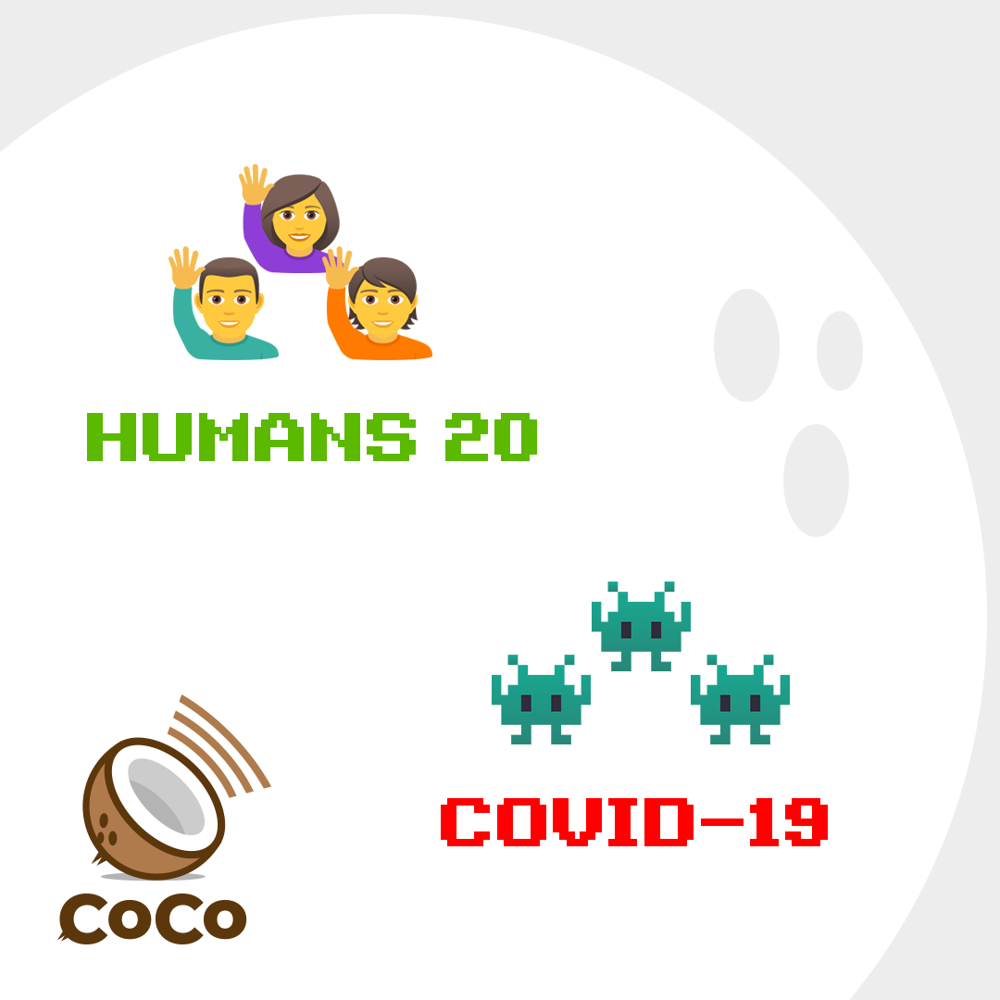

# Humans vs. Virus



## Copy, paste, and post:


There is only one enemy: \#Coronavirus. If we work together, we will win. \#humans20covid19 \#coco


## Why This is Important:


Helping the public understand that arguing and blaming each other wastes precious time and energy, which we must focus into the fight against the virus. \[Source: [Center for Disease Control](https://www.cdc.gov/flu/pandemic-resources/pdf/workshop.pdf)\]


## Shoot a video:

_No fancy set. No hair and makeup. No need to memorize. Just turn the camera on yourself \(in landscape mode\) and read one of these lines:_

* Hi, I'm \[NAME\] reminding you that GREAT TEAMS DO GREAT THINGS. Humanity is one great team. When we work together, we win. And the final score is going to be HUMANS 20, COVID-19. Now take this message and pass it on: spread the word, not the germ. 
* This is \[NAME\] reminding you that \#Coronavirus wants humans to fight, so it can win. DON'T GIVE IN. When we work together, we win. Now take this message and pass it on: spread the word, not the germ. 
* I'm \[NAME\] and here's what I believe: To defeat \#Coronavirus, we have to think like a virus. That means working together, as one human species. Now take this message and pass it on: spread the word, not the germ. 
* Hey, this is \[NAME\] reminding you that if we stick together, we save the world. If we work together, we win in the fight against \#Coronavirus. Now take this message and pass it on: spread the word, not the germ!  
* This is \[NAME\]. Arguing and blaming each other wastes precious time and energy, which we must focus into the fight against the virus. When we work together, we win. Now take this message and pass it on: spread the word, not the germ!

## Use this hashtag:


\#humans20covid19


## Share these images:

## Additional Notes:

* To be deployed in all global regions ASAP.
* Please help by translating this message into your local language. \[See [How to Help](../how-to-help.md)\]
* Be wary of falling into the trap of "arguing about not arguing."

