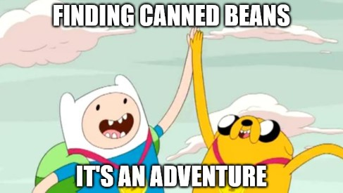

# It's An Adventure

## Primary Message:


We can choose to complain, or we can choose to look on this time as a great human adventure.  


## Why This is Important:


Helping the public reframe the \#Coronacrisis as an adventure with a beginning, a middle, and an end. \[Source: [The Power of Myth](https://www.amazon.com/dp/B004QZACH6)\]


## Message Points:

_5-10 message points that can be used as "springboards" for blog posts and social media._

* We can choose to bitch and moan, to argue and complain, or we can choose to see this time as a great adventure. \#ItsAnAdventure
* Shmow-zow! This time in human history is certainly algebraic! \#AdventureTime
* Thought for the day: every one of us will be able to tell our grandkids about this time in history. \#ItsAnAdventure
* KEEP A DIARY. You will want to remember every day of this time in history: what it was like, how people interacted, how you spent your time. \#ItsAnAdventure
* WE ARE LIVING IN HISTORY. This is something every kid in the future will have to learn about. YOU ARE LIVING IT. \#ItsAnAdventure

## Link Here:



## Use this Hashtag:


\#ItsAnAdventure, \#AdventureTime


## Supporting Visuals:

## Additional Notes:

* To be deployed in all global regions ASAP.
* Need translators to communicate this message locally. \[See [How to Help](../how-to-help.md)\]

