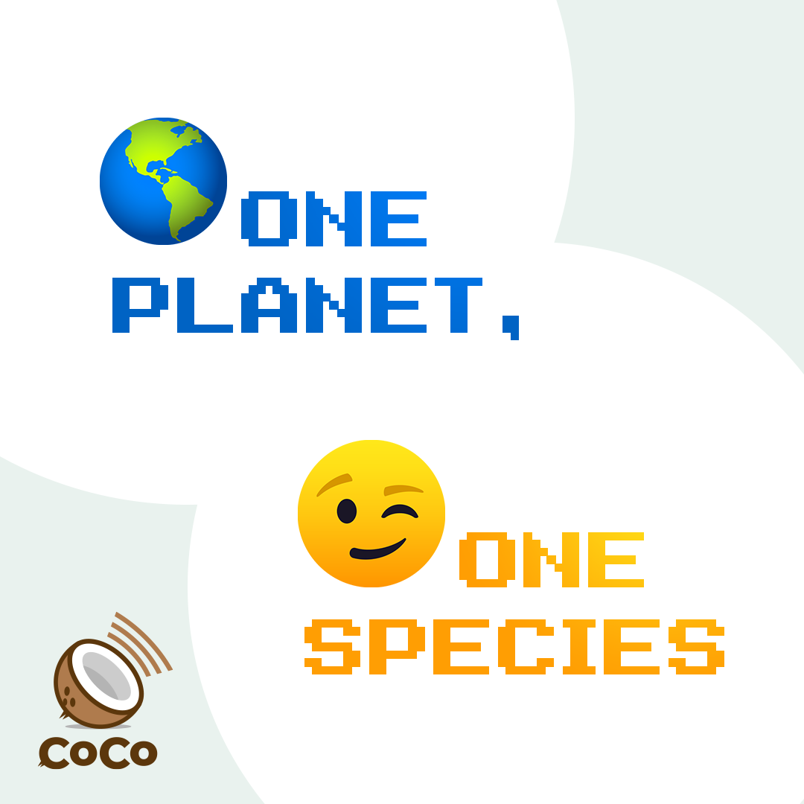

# One Planet, One Species



## Copy, paste, and post:


We are literally one human organism. That's how the virus thinks. That's how we will defeat it. \#1planet1species


## Why This is Important:


Helping the public understand the virus does not see nations, races, or religions: it just sees one human host, so human cooperation is essential. \[Source: [Center for Disease Control](https://www.cdc.gov/flu/pandemic-resources/pdf/pandemic-influenza-strategy-2005.pdf)\]


## Shoot a video:

_5-10 message points that can be used as "springboards" for blog posts and social media._

* Hi, I'm \[NAME\]. We are literally one human organism. That's how the virus thinks. That's how we will defeat it. ONE PLANET, ONE SPECIES. Now take this message and pass it on: spread the word, not the germ.

* This is \[NAME\] reminding you that the \#Coronavirus does not see nations, races, or religions: it just sees one human host, so humans must act as one. ONE PLANET, ONE SPECIES. Now take this message and pass it on: spread the word, not the germ. 
* I'm \[NAME\] and I want to remind you that there's only one way to defeat \#Coronavirus: working as one to defeat it. ONE PLANET, ONE SPECIES. Now take this message and pass it on: spread the word, not the germ. 
* This is \[NAME\] remind you that nations are a human invention. The \#Coronavirus doesn't work that way. ONE PLANET, ONE SPECIES. Now take this message and pass it on: spread the word, not the germ. 
* \[NAME\] here. In order to defeat a virus, you've got to think like a virus. WORK TOGETHER HUMANS! We are \#1planet1species. Now take this message and pass it on: spread the word, not the germ.

## Use this hashtag:


\#1planet1species


## Share media:



## Additional Notes:

* To be deployed in all global regions ASAP.
* Need translators to communicate this message locally. \[See [How to Help](../how-to-help.md)\]
* Need musicians to write songs with this message. \[See [How to Help](../how-to-help.md)\]

