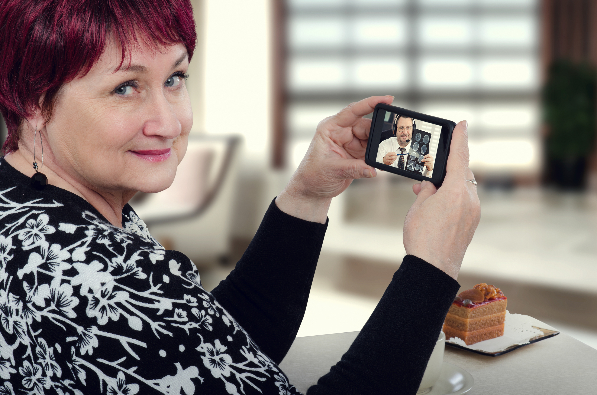

# Stay Focused

## Primary Message:


During the \#Coronacrisis, every day brings new drama and new distractions: just STAY FOCUSED on what you need to do today.


## Why This is Important:


Helping the public understand that a day-to-day \#ODAT approach can help us get this work done without feeling overwhelmed. \[Source: [Homeland Security Council](https://www.cdc.gov/flu/pandemic-resources/pdf/pandemic-influenza-strategy-2005.pdf)\]


## Message Points:

_5-10 message points that can be used as "springboards" for blog posts and social media._ 

* As much as possible, keep a normal routine. \#BusinessAsUsual even though business unusual.
* Get up at the same hour. Start and stop your work at the same hour. Make a \#NewNormal.
* Make a daily \#ToDo list. Literally cross off items as you complete them: it feels good.
* Keep yourself looking good. Shower. Shave. Practice self care. 
* Keep your living space and your working space clean. At the end of each day, tidy up. Try it and see.
* Defy the drama: resist the urge to worry, obsess, gossip, bitch, or complain. Channel that energy into positive action. 
* Learn how to use new technology. This is a perfect time to \#LearnToLearn.
* Keep regular meetings with family, friends, and coworkers by videoconference. Consider scheduling a time.
* \#GSD.
* Avoid The Great Timewasters of alcohol, drugs, and porn -- or keep them for weekends.
* Donate 10% of your time to helping others.

## Target URL:

_Where do we want people to go? Please use high-authority websites \(WHO.int, CDC.gov, etc.\)._



## Hashtags:


\#gsd, \#odat, \#stayfocused


## Supporting Visuals:

## Additional Notes:

* To be deployed in all global regions ASAP.
* Please help by translating this message into your local language.

