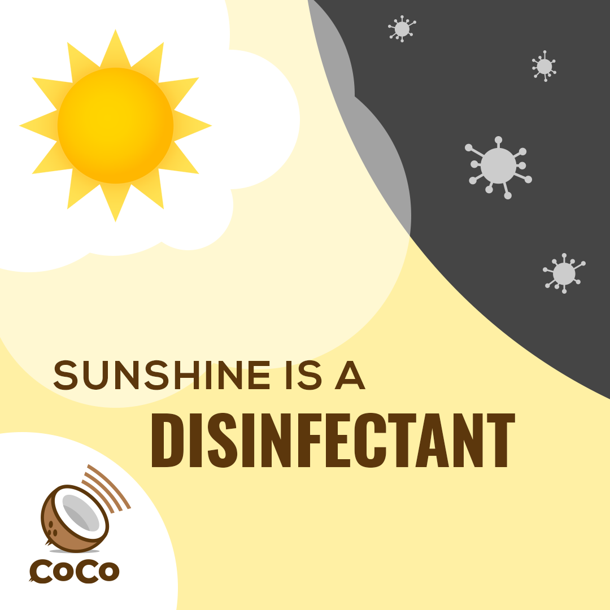

# Sunshine is a Disinfectant



## Copy, paste, and post:


The flu virus withers in sunlight: practice social distancing and common sense, but GET OUTSIDE. \#coco


## Why This is Important:


Helping the public understand that fresh air is good for mental and physical stimulation, BUT we must still practice all health precautions. \[Source: World Health Organization\]

_NOTE: This does NOT mean that sunshine kills Coronavirus! Please read the_ [_common misunderstandings on the WHO website_](https://www.who.int/emergencies/diseases/novel-coronavirus-2019/advice-for-public/myth-busters)_, and communicate responsibly._


## Shoot a video:

_No fancy set. No hair and makeup. No need to memorize. Just turn the camera on yourself \(in landscape mode\) and read one of these lines:_

* This is \[NAME\] reminding you that sunshine is a powerful disinfectant. Practice social distancing and exercise common sense, but GET OUTSIDE. Now take this message and pass it on: spread the word, not the germ. 
* \[NAME\] here, reminding you that the flu virus withers under sunlight. Practice social distancing and exercise common sense, but GET OUTSIDE. Now take this message and pass it on: spread the word, not the germ. 
* I'm \[NAME\]. A little exercise is good for the body, mind, and spirit. Practice social distancing and common sense, but GET OUTSIDE and GET SOME \#SUNSHINE. Now take this message and pass it on: spread the word, not the germ. 
* This is \[NAME\] reminding you that sunshine doesn't kill \#Coronavirus, but it certainly doesn't hurt. Practice social distancing and common sense, but GET SOME \#SUNSHINE. 
* Hi, this is \[NAME\]. Soak up some \#sunshine. It's refreshing. _\[Note: even better if you're actually outdoors.\]_

## PLEASE NOTE:

BE CAREFUL not to confuse "get some sunshine" with other messages. Check out \(and share\) [common misunderstandings on the World Health Organization website](https://www.who.int/emergencies/diseases/novel-coronavirus-2019/advice-for-public/myth-busters).

## Use this hashtag:


\#sunshine


## Share media:

## Additional Notes:

* To be deployed in all global regions ASAP.
* Need translators to communicate this message locally. \[See [How to Help](../how-to-help.md)\]

