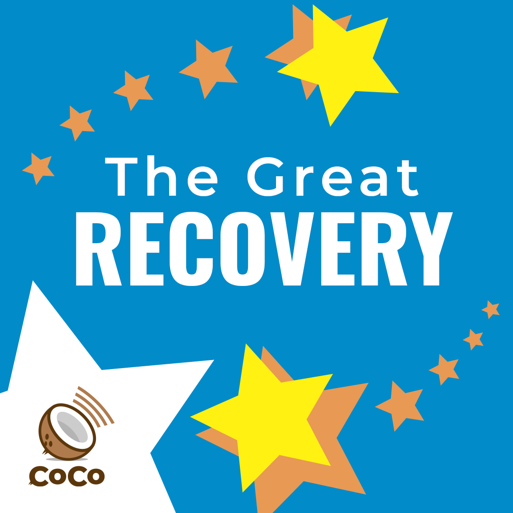

# The Great Recovery



## Copy, paste, and post:


When we get through sickness, we're even stronger. Get ready for the \#GreatRecovery. \#coco


## Why This is Important:


Helping people understand that WE WILL GET THROUGH THIS. Because this is a global pandemic, it will likely be followed by a global recovery. \[Source: [World Health Organization](https://www.who.int/publications-detail/outbreak-communication-best-practices-for-communicating-with-the-public-during-an-outbreak)\]


## Shoot a video:

_No fancy set. No hair and makeup. No need to memorize. Just turn the camera on yourself \(in landscape mode\) and read one of these lines:_

* This is \[NAME\] reminding you to get ready for the \#GreatRecovery. I don't know if it will happen next week or next year, but it's coming. Get ready! Spread the word, not the germ: the \#GreatRecovery. 
* \[NAME\] here, reminding you to look for the \#GreatRecovery. It's going to be a planetary boom. It's going to be the greatest time to be alive. It's going to be the \#GreatRecovery. Spread the word, not the germ: \#GreatRecovery. 
* This is \[NAME\]. A global recession means eventually a global recovery. We call it the \#GreatRecovery. It's coming. I promise. Spread the word, not the germ. \#CoCo

## Use this hashtag:


\#GreatRecovery


## Share media:

Please submit high-quality images and memes. \[See [How to Help](../how-to-help.md)\]

## Additional Notes:

* To be deployed in all global regions ASAP.
* Need translators to communicate this message locally. \[See [How to Help](../how-to-help.md)\]

