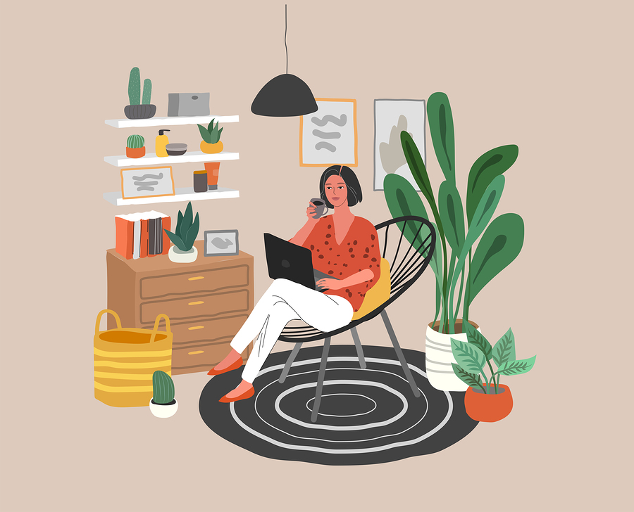

# Working From Home

## Primary Message:

_Strive for a one-sentence message that is clear, actionable, and inspiring._


While working from home, there are "hacks" you can use to keep yourself productive, which is important in the fight against COVID-19.


## Message Points:

_5-10 message points that can be used as "springboards" for blog posts and social media._

* As much as possible, keep your normal work routine.
* Get up at the same hour. Start and stop your work at the same hour.
* Keep yourself looking good. Aim for "dressy casual."
* Learn how to use videoconference tools. Upgrade your video space.
* Try to keep your workspace noise-free and distraction-free, as best you can.
* Keep regular team meetings by videoconference. Consider "Monday morning kickoffs."
* Consider standing one-on-one videoconferences with each team member as well.
* As best you can, continue "business as usual." 
* Consider donating 10-20% of your time to how your business can help others in this time.

## Target URL:

_Where do we want people to go? Please use high-authority websites \(WHO.int, CDC.gov, etc.\)._



## Target Audience:

_Who we are trying to reach with this message._


Anyone working from home, especially those who have never worked from home before.


## Hashtags:

_Strive for hashtags that are memorable, unique, and clever._


\#workwell, \#coco, \#coronavirus


## Supporting Visuals:

_Fully-licensed images that can be used in content and memes. Images must be royalty-free; please link to source._

## Why This is Important:

_In one sentence, explain why this message matters to our strategy._


Staying productive is important for the world economy, for our businesses, and for our self-esteem.


## Additional Notes:

_To be communicated ASAP and ongoing. Better photos would be appreciated, especially funny photos or memes._

