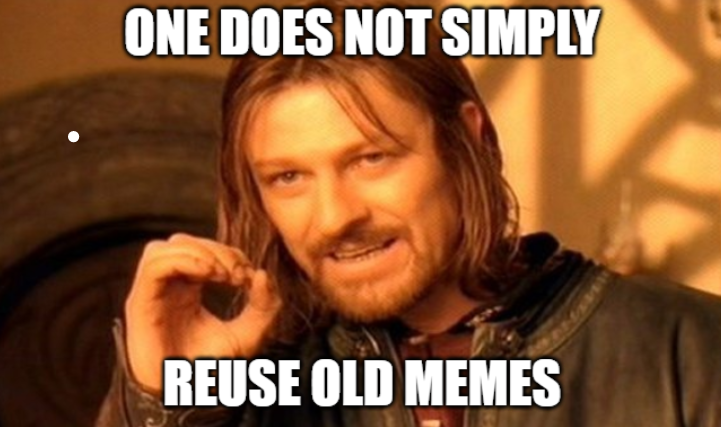

## Primary Message:

_Strive for a one-sentence message that is clear, actionable, and inspiring._


Primary message here


## Message Points:

_5-10 message points that can be used as "springboards" for blog posts and social media._

* _Points should be 140 characters or less_
* _Many people will copy and paste them_

## Target URL:

_Where do we want people to go? Please use high-authority websites \(WHO.int, CDC.gov, etc.\)._



## Target Audience:

_Who we are trying to reach with this message._


Primary reason here


## Hashtags:

_Strive for hashtags that are memorable, unique, and clever._


Hashtags here


## Supporting Visuals:

_Fully-licensed images that can be used in content and memes. Images must be royalty-free; please link to source._

## Why This is Important:

_In one sentence, explain why this message matters to the CoCo strategy._


Primary reason here


## Additional Notes:

_Message dates, message regions, etc._

