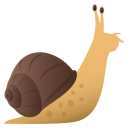
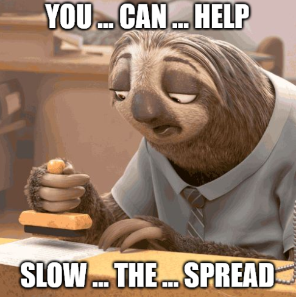
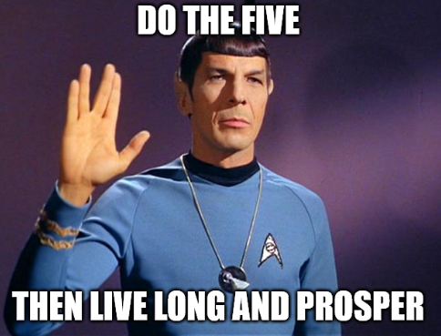

# Slow the Spread

## Primary Message:


We are trying to SLOW THE SPREAD of \#Coronavirus, to ease the burden on our \#HealthcareHeroes.


## Why This is Important:


Helping the public understand that we can't currently stop Coronavirus, but we can slow the spread.


## Message Points:

_5-10 message points that can be used as "springboards" for blog posts and social media._

* We are trying to SLOW THE SPREAD of \#Coronavirus to help our Healthcare Heroes. 
* When you \#DoTheFive, you don't just protect yourself, you protect others. This SLOWS THE SPREAD of \#Covid19 and helps our Healthcare Heroes. 
* 1\) HANDS Wash them often. 2\) ELBOW Cough into it. 3\) FACE Don't touch it. 4\) FEET Stay more than 3ft apart. 5\) FEEL sick? Stay home. \#SlowTheSpread of \#Coronavirus! 
* When you \#DoTheFive, it's like tripping the \#Coronavirus while it's running. \#SlowTheSpread!
* Outgunned. Outmanned. Outnumbered, outplanned. We gotta make an all-out stand. And yo you're gonna need to wash your hands. \#SLOWTHESPREAD of \#Coronavirus ft. \#Hamilton and @Lin\_Manuel

## Target URL:

[https://www.who.int/emergencies/diseases/novel-coronavirus-2019/advice-for-public](https://www.who.int/emergencies/diseases/novel-coronavirus-2019/advice-for-public)

## Hashtags:


\#SlowTheSpread, \#DoTheFive, \#coronavirus, \#coco


## Supporting Visuals:

Video of health official accidentally licking her finger \(you can't unsee it\):



## Additional Notes:

To be deployed ASAP in all regions.

